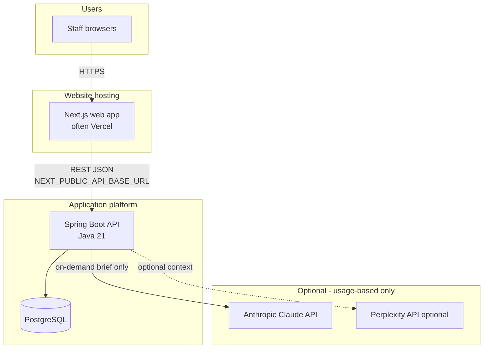

# Architecture

This document describes how the application is built and deployed so you can plan **hosting, cost, security, and integrations**.

**Repository:** monorepo with `frontend/` (web) and `backend/` (API and data jobs).  
**Product:** Price-intelligence for Swiss procurement — EU e-bike listings, CHF landed pricing, search, sourcing views, optional competitor monitoring.

---

## 1. Executive summary

- The system is a **standard three-tier style deployment**: **web app** → **REST API** → **PostgreSQL**. It is **not** an “always-on AI” product.
- **Claude (Anthropic)** and optional **Perplexity** are used **only** for a single **on-demand** feature (AI text brief on Competitor Watch). They can be **left unconfigured**; the rest of the application still runs.
- **Scheduled work** (FX updates, optional crawls, competitor HTTP snapshots) runs on the **API server**, not on the website host.

---

## 2. Logical architecture

**Separation rule:** The public **website does not contain database credentials or LLM keys**. The browser calls your **API URL**; the API holds secrets and talks to the database.

---

## 3. Components

### 3.1 Frontend (`frontend/`)

| Item | Detail |
|------|--------|
| **Stack** | Next.js 14 (React), Tailwind CSS, internationalization (English + German CH). |
| **Role** | Renders pages (listings, wish search, competitive pricing, competitor watch, sourcing, legal). |
| **Configuration** | `NEXT_PUBLIC_API_BASE_URL` points to the Spring API (no trailing slash). |
| **Staff access (browser)** | Optional shared password via environment variable `STAFF_UI_PASSWORD` on the **hosting** platform; session uses an httpOnly cookie. Does **not** replace enterprise SSO unless you add it later. |

### 3.2 Backend (`backend/`)

| Item | Detail |
|------|--------|
| **Stack** | Java 21, Spring Boot, JPA, Flyway migrations. |
| **Role** | REST API under `/api/v1/...` (offers, wishes, sources, FX, system/import, alerts, competitor watch, optional AI brief proxy logic). |
| **Data** | PostgreSQL — listings, pricing references, FX rates, snapshots, etc. |
| **Scheduled jobs** | Run **inside this process** (same deployment): e.g. ECB EUR→CHF, optional marketplace crawls, optional daily competitor HTTP snapshots. **These are not LLM calls.** |

### 3.3 Data store

- **PostgreSQL** is the system of record. Access is **only** from the Spring API (not from the browser).

---

## 4. Artificial intelligence (cost and scope)

| Question | Answer |
|----------|--------|
| **Is the whole app “AI-powered”?** | **No.** Core value is data ingestion, pricing rules, and search — **deterministic** business logic. |
| **Where is Claude used?** | **Only** when generating the **Competitor Watch AI brief** (`POST /api/v1/competitor-watch/brief`). Typically **one** Claude request per generation; **optional** Perplexity call for Swiss market context. |
| **If we omit API keys?** | The brief button stays **disabled** or returns “not configured”; **all other features** can still operate. |
| **Cost model** | LLM spend scales with **how often staff generate briefs**, not with “app uptime.” Budget = usage × vendor pricing (Anthropic / Perplexity). |

---

## 5. Deployment model (typical)

| Piece | Common choice | Notes |
|-------|----------------|-------|
| **Web UI** | Vercel (root directory `frontend/`) | Static/SSR frontend; env vars for API URL and optional staff password. |
| **API + jobs** | Render, Railway, Fly.io, Kubernetes, VM | Must run **continuously** if you use **cron** crawls or competitor snapshots. |
| **Database** | Managed PostgreSQL (same region as API when possible) | Connection string and credentials only on API side. |

**CORS:** The API must allow the web origin (`EBF_CORS_ORIGINS`).

**Detailed checklist:** see **`DEPLOY.md`** in the repository.

---

## 6. Security and compliance (high level)

- **Secrets** (DB passwords, `EBF_STAFF_API_TOKEN`, `ANTHROPIC_API_KEY`, `STAFF_UI_PASSWORD`, etc.) belong in the **hosting provider’s environment**, not in Git.
- **`.env.local`** on a developer machine is for local use only and is **gitignored**.
- Privacy/legal pages exist in the app; final **nDSG / legal** alignment is a separate business task before production launch.

---

## 7. Further reading (in repo)

| Document | Content |
|----------|---------|
| **`README.md`** | Run locally, features, crawl notes. |
| **`DEPLOY.md`** | Vercel + API + env vars + checklist. |
| **`docs/SCOPE_AND_PHASE2.md`** | Scope and roadmap (keep updated). |

---

## 8. Technical follow-up

Use this document together with **`DEPLOY.md`** for infrastructure planning. For **cost estimates**, separate **fixed** hosting (Vercel + API + DB) from **variable** LLM usage (brief generations per month × vendor rates).

---

*Document version: aligned with repository layout (Next.js 14 frontend, Spring Boot 3.3 backend). Update this file if deployment or AI boundaries change.*
